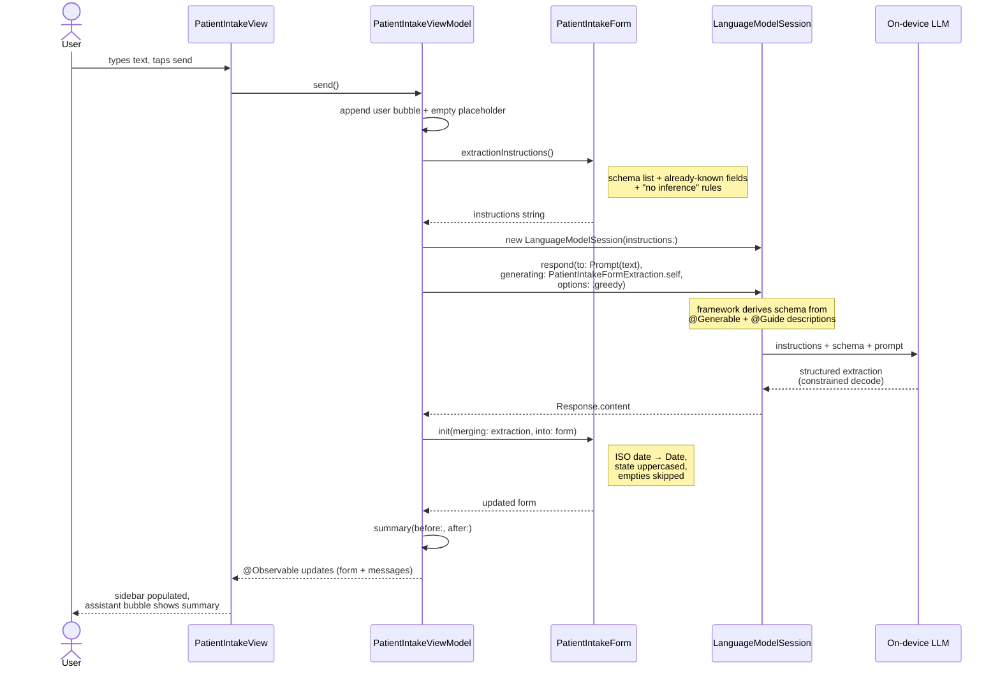

# Step 2: Conversational form-fill with `@Generable`

This walks through everything we did to take the chat surface from [step 1](step1.md) and grow it into a real JSON-driven form-fill feature: typed Swift structs that mirror `basic_information.json`, an Apple `@Generable` extraction model the on-device LLM fills, a prompt generator with a "no inference" rule, and a chat-style intake screen that updates a live form sidebar as the user talks.

By the end you'll have:

- A typed domain model (`PatientIntakeForm`) with `Date?`, nested `Address`, and `Codable` for JSON round-trip.
- A separate `@Generable` extraction mirror (`PatientIntakeFormExtraction`) the on-device model fills, plus a merge that folds it back into the domain type.
- A prompt generator that describes the schema, lists already-captured fields, and forbids inference.
- A `PatientIntakeViewModel` with its own `LanguageModelSession`, tuned `GenerationOptions` for structured extraction, and a friendly per-turn summary.
- A reusable `ConversationView` shell (extracted from `ChatView`) that powers both the chat and the intake screens.
- A `PatientIntakeView` that pairs the chat shell with a live form sidebar, size-class-aware for iPhone and iPad.

## Prerequisites

- You finished [step 1](step1.md). The chat screen builds and runs.
- Apple Intelligence is enabled on your host Mac and on your test simulator (see [`APPLE_INTELLIGENCE_SETUP.md`](APPLE_INTELLIGENCE_SETUP.md)).
- A skim of [`FOUNDATION_MODELS_OPTIMIZATION.md`](FOUNDATION_MODELS_OPTIMIZATION.md) — the `@Generable` and `GenerationOptions` decisions in this step come straight from it.

---

## Step 1 — Plan the move from chat to form-fill

Two pieces of context shape every decision below:

- **Schema source of truth.** `basic_information.json` at the repo root defines the form: rows of fields with `id`, `type`, `isRequired`, `maxCharacters`, plus a composite `address` field with nested `subFields`. Whatever Swift types we build have to round-trip with this shape — and the LLM's structured output has to land in something that can become it.
- **`@Generable`, not "please return JSON".** `FOUNDATION_MODELS_OPTIMIZATION.md` is explicit: use Apple's guided generation, not free-form JSON parsing. The runtime constrains decoding to the type, so the model can't emit invalid shapes. Faster, more reliable, no fragile parsing.

The plan: define the domain type the rest of the app will use → define a sibling `@Generable` type the LLM fills → write a small merge → tune the session for extraction → wrap it all in an MVVM ViewModel → reuse the chat UI for the screen.

## Step 2 — Define the domain model

Create `FoundationForms/Models/PatientIntakeForm.swift`:

```swift
import Foundation

struct PatientIntakeForm: Codable, Equatable, Sendable {
    var firstName: String?
    var lastName: String?
    var dateOfBirth: Date?
    var address: Address?
    var symptoms: String?

    struct Address: Codable, Equatable, Sendable {
        var street: String?
        var city: String?
        var state: String?
        var zip: String?
    }

    // Per-field constraints mirrored from basic_information.json. Shared so the
    // prompt generator and any UI validation reference one source of truth.
    enum MaxLength {
        static let firstName = 50
        static let lastName = 60
        static let street = 255
        static let city = 100
        static let zip = 10
        static let symptoms = 2000
    }
}
```

Things worth pointing out:

- **Everything is optional.** A partially-filled form is a legitimate state — the user might have only said their name. Optionals also let the merge step distinguish "the LLM didn't extract this" from "the LLM extracted an empty string."
- **`Date?`, not `String?`.** This is the *domain* model — the rest of the app deserves a real `Date`. The LLM-facing type, defined next, will use `String?` for the date and we'll convert at the boundary.
- **`MaxLength` is `enum`, not `struct`.** A caseless enum can't be instantiated, so it can only be used as a namespace for constants. That's exactly what we want.
- **`Codable` survives.** The same struct can decode the patient half of a `basic_information.json`-shaped payload (or be persisted) without any extra work.

## Step 3 — Define the `@Generable` extraction mirror

The catch: `@Generable` only supports a fixed set of primitive types — `String`, `Int`, `Float`, `Double`, `Bool`, arrays of those, and other `@Generable` types. **`Date` is not in that list.** Trying to put `var dateOfBirth: Date?` on a `@Generable` struct won't compile.

Two options. (a) Use `String?` for the date on the domain type and live with the loss of typing. (b) Keep `Date?` on the domain type and have a separate `@Generable` mirror that uses `String?` for the date.

We picked (b). The cost is one extra struct and a tiny merge function; the benefit is that every other layer of the app — UI, validation, persistence — gets a strongly-typed `Date`.

Create `FoundationForms/Models/PatientIntakeFormExtraction.swift`:

```swift
import Foundation
import FoundationModels

@Generable
struct PatientIntakeFormExtraction: Sendable {

    @Guide(description: "Patient's legal first name. Maximum 50 characters.")
    var firstName: String?

    @Guide(description: "Patient's legal last name. Maximum 60 characters.")
    var lastName: String?

    @Guide(description: "Patient's date of birth as an ISO 8601 calendar date in YYYY-MM-DD format, e.g. \"1985-04-23\".")
    var dateOfBirth: String?

    @Guide(description: "Patient's mailing address. Omit any sub-field the user did not state.")
    var address: AddressExtraction?

    @Guide(description: "Patient's reported symptoms in their own words. Maximum 2000 characters.")
    var symptoms: String?

    @Generable
    struct AddressExtraction: Sendable {
        @Guide(description: "Street address including number, name, and unit if any. Maximum 255 characters.")
        var street: String?

        @Guide(description: "City name. Maximum 100 characters.")
        var city: String?

        @Guide(description: "Two-letter US state postal code in uppercase, e.g. \"CA\" or \"NY\".")
        var state: String?

        @Guide(description: "5- or 9-digit US ZIP code, e.g. \"94103\" or \"94103-1234\". Maximum 10 characters.")
        var zip: String?
    }
}

extension PatientIntakeForm {
    /// Overlays an LLM extraction onto an existing form. Empty/nil extracted values
    /// are ignored so confirmed fields from prior turns survive.
    init(merging extraction: PatientIntakeFormExtraction, into base: PatientIntakeForm = .init()) {
        self = base
        if let v = extraction.firstName?.nonEmpty { firstName = v }
        if let v = extraction.lastName?.nonEmpty { lastName = v }
        if let v = extraction.dateOfBirth?.nonEmpty, let date = Self.parseISODate(v) {
            dateOfBirth = date
        }
        if let v = extraction.symptoms?.nonEmpty { symptoms = v }

        if let ea = extraction.address {
            var a = base.address ?? Address()
            if let v = ea.street?.nonEmpty { a.street = v }
            if let v = ea.city?.nonEmpty { a.city = v }
            if let v = ea.state?.nonEmpty { a.state = v.uppercased() }
            if let v = ea.zip?.nonEmpty { a.zip = v }
            address = a
        }
    }

    nonisolated static func parseISODate(_ s: String) -> Date? {
        try? Date(s.trimmingCharacters(in: .whitespaces),
                  strategy: Date.ISO8601FormatStyle().year().month().day())
    }

    nonisolated static func isoString(from date: Date) -> String {
        date.formatted(Date.ISO8601FormatStyle().year().month().day())
    }
}

private extension String {
    var nonEmpty: String? {
        let t = trimmingCharacters(in: .whitespacesAndNewlines)
        return t.isEmpty ? nil : t
    }
}
```

Things worth pointing out:

- **`@Guide(description:)` is your prompt-in-the-type.** Apple's guided generation *uses* these descriptions when composing the schema for the model. Be specific — formats, units, examples. The ZIP `@Guide` mentions both 5- and 9-digit shapes; the state `@Guide` says "uppercase two-letter postal code" so you don't get `"California"`.
- **Dates round-trip through ISO strings.** `Date.ISO8601FormatStyle().year().month().day()` produces `"1985-04-23"` and parses the same back. It's `Sendable`, modern, and precisely the format we asked the model to emit.
- **Merge is non-destructive.** `if let v = extraction.firstName?.nonEmpty` only overwrites when the extraction produced a real value. A second turn that mentions only the symptoms won't wipe out the name captured in the first turn.
- **State is upper-cased on the way in.** Even though the prompt asks for uppercase, defending in the merge is cheap and saves a class of bugs.
- **`nonisolated static` helpers.** The project's `SWIFT_DEFAULT_ACTOR_ISOLATION = MainActor` setting makes top-level types MainActor-isolated by default. These helpers are pure value transforms — marking them `nonisolated` means they can be called from anywhere, including the merge (which is a struct initializer with no actor context).

## Step 4 — Build the prompt generator

Create `FoundationForms/Models/PatientIntakeForm+Prompt.swift`:

```swift
import Foundation

extension PatientIntakeForm {
    /// System-instructions string for a Foundation Models extraction session.
    ///
    /// `self` is the current state of the form — already-captured fields are listed
    /// so the model preserves them across turns instead of re-extracting from scratch.
    func extractionInstructions() -> String {
        var lines: [String] = []
        lines.append("You extract structured patient-intake data from the user's conversational message.")
        lines.append("Return a PatientIntakeFormExtraction with the following fields:")
        lines.append("")
        lines.append("- firstName (string, required, max \(MaxLength.firstName) chars) — patient's legal first name.")
        lines.append("- lastName (string, required, max \(MaxLength.lastName) chars) — patient's legal last name.")
        lines.append("- dateOfBirth (string, required) — date of birth in ISO 8601 YYYY-MM-DD format.")
        lines.append("- address.street (string, required, max \(MaxLength.street) chars).")
        lines.append("- address.city (string, required, max \(MaxLength.city) chars).")
        lines.append("- address.state (string, required) — two-letter US postal code in uppercase, e.g. \"CA\".")
        lines.append("- address.zip (string, required, max \(MaxLength.zip) chars) — US ZIP code.")
        lines.append("- symptoms (string, required, max \(MaxLength.symptoms) chars) — patient's reported symptoms in their own words.")
        lines.append("")

        let known = knownFieldLines()
        if !known.isEmpty {
            lines.append("Already captured from prior turns. Preserve these exactly unless the user explicitly corrects them:")
            for line in known { lines.append("- \(line)") }
            lines.append("")
        }

        lines.append("RULES:")
        lines.append("- Only extract information explicitly stated by the user. Do not infer or add data.")
        lines.append("- If a field is not mentioned, leave it null.")
        lines.append("- Do not invent or guess names, dates, addresses, ZIP codes, or symptoms.")
        lines.append("- Preserve the user's own wording for free-text fields like symptoms.")
        lines.append("- Return only structured field values — no prose, no commentary.")
        return lines.joined(separator: "\n")
    }

    private func knownFieldLines() -> [String] {
        var out: [String] = []
        if let v = firstName, !v.isEmpty { out.append("firstName: \(v)") }
        if let v = lastName, !v.isEmpty { out.append("lastName: \(v)") }
        if let d = dateOfBirth { out.append("dateOfBirth: \(Self.isoString(from: d))") }
        if let a = address {
            if let v = a.street, !v.isEmpty { out.append("address.street: \(v)") }
            if let v = a.city, !v.isEmpty { out.append("address.city: \(v)") }
            if let v = a.state, !v.isEmpty { out.append("address.state: \(v)") }
            if let v = a.zip, !v.isEmpty { out.append("address.zip: \(v)") }
        }
        if let v = symptoms, !v.isEmpty { out.append("symptoms: \(v)") }
        return out
    }
}
```

Things worth pointing out:

- **Instance method, not free function.** `self` *is* the "form so far." Making it an instance method means the call site reads `form.extractionInstructions()` — natural and easy to inject in tests.
- **Constraints come from `MaxLength`.** No magic numbers in prose. If you change `basic_information.json`, you change `MaxLength`, and both the prompt and any UI validation update together.
- **The "no inference" rule is verbatim.** This is the single most important sentence in the prompt — without it, the model will happily guess a ZIP code from a city name. The follow-up rules ("if not mentioned, null"; "do not invent") repeat the same idea in concrete terms because diffuse rules are easier for the model to comply with than abstract ones.
- **"Already captured" supports iteration.** When the form already has a name, the prompt tells the model so. That stops the model from re-extracting from old context (which it doesn't have access to anyway) and from blanking out a confirmed field on a turn that doesn't mention it.

## Step 5 — Build the extraction ViewModel

Create `FoundationForms/ViewModels/PatientIntakeViewModel.swift`:

```swift
import Foundation
import FoundationModels

@Observable
final class PatientIntakeViewModel {
    var form: PatientIntakeForm
    var messages: [ChatMessage]
    var draft: String = ""
    var isWorking: Bool = false
    var lastError: String?
    let availability: SystemLanguageModel.Availability

    private var session: LanguageModelSession?

    init(
        seed: PatientIntakeForm = .init(),
        seedMessages: [ChatMessage]? = nil
    ) {
        self.form = seed
        self.messages = seedMessages ?? [Self.greeting]
        self.availability = SystemLanguageModel.default.availability
        if case .available = availability {
            self.session = Self.makeSession(for: seed)
        }
    }

    func prewarm() { session?.prewarm() }

    func send() async {
        let text = draft.trimmingCharacters(in: .whitespacesAndNewlines)
        guard !text.isEmpty, case .available = availability else { return }

        draft = ""
        messages.append(ChatMessage(content: text, isUser: true))

        let placeholder = ChatMessage(content: "", isUser: false)
        let placeholderID = placeholder.id
        messages.append(placeholder)

        // Rebuild so the instructions reflect the latest "already known" state.
        let session = Self.makeSession(for: form)
        self.session = session

        isWorking = true
        lastError = nil
        defer { isWorking = false }

        let before = form
        do {
            let response = try await session.respond(
                to: Prompt(text),
                generating: PatientIntakeFormExtraction.self,
                options: Self.extractionOptions
            )
            form = PatientIntakeForm(merging: response.content, into: before)
            updatePlaceholder(id: placeholderID, content: Self.summary(before: before, after: form))
        } catch let error as LanguageModelSession.GenerationError {
            let msg = Self.userMessage(for: error)
            lastError = msg
            updatePlaceholder(id: placeholderID, content: msg)
        } catch {
            let msg = "Extraction failed: \(error.localizedDescription)"
            lastError = msg
            updatePlaceholder(id: placeholderID, content: msg)
        }
    }

    private func updatePlaceholder(id: UUID, content: String) {
        guard let idx = messages.firstIndex(where: { $0.id == id }) else { return }
        messages[idx].content = content
    }

    private static let greeting = ChatMessage(
        content: "Hi! Tell me about the patient — name, date of birth, address, and what they're experiencing.",
        isUser: false
    )

    private static func makeSession(for form: PatientIntakeForm) -> LanguageModelSession {
        LanguageModelSession(instructions: Instructions(form.extractionInstructions()))
    }

    // Greedy + low-temperature settings for deterministic structured extraction
    // (per FOUNDATION_MODELS_OPTIMIZATION.md "Tune GenerationOptions per task").
    private static let extractionOptions = GenerationOptions(
        sampling: .greedy,
        temperature: 0.1,
        maximumResponseTokens: 512
    )

    // ... summary(before:after:), changedFieldLabels, missingFieldLabels,
    //     userMessage(for:) — see the file in the repo for the full text.
}
```

Things worth pointing out:

- **Different session from chat.** Chat owns its own `LanguageModelSession` in `ChatViewModel`. Intake owns a separate one. That's deliberate — `FOUNDATION_MODELS_OPTIMIZATION.md` recommends "When the user moves from chit-chat to filling a form, build a *new* `LanguageModelSession` for the form. The form-fill session's prefix cache is then pure schema + instructions, not polluted by earlier banter."
- **`GenerationOptions` is tuned for extraction.** `.greedy` sampling + `temperature: 0.1` is what you want for "extract a ZIP code." Conversational defaults reward creativity; structured extraction punishes it. `maximumResponseTokens: 512` is plenty for the whole form and saves latency.
- **Session is rebuilt every turn.** The instructions embed the "already known" snapshot, and that snapshot changes after every successful extraction. Rebuilding loses prefix-cache warmth, but the win — the model sees the right context — outweighs the cost. Optimizing this is a future iteration; keep an `if-anything-changed` cache if you do.
- **`session.respond(to:generating:options:)`, not streaming.** Structured extraction returns a complete value or fails — there's nothing useful to show mid-stream. Use `streamResponse` for chat, `respond` for extraction.
- **Per-turn summary is the assistant reply.** After each extraction, `Self.summary(before:after:)` produces text like *"Got first name, last name. Still need: address, symptoms."* That gives the user a tight feedback loop without needing them to look at the sidebar after every turn.
- **Mirrors `ChatViewModel`'s shape.** `messages`, `draft`, `isWorking`, a `send()` that appends a user bubble and updates a placeholder by id — same idioms, same error mapping. That's what makes the next step's UI reuse possible.

### How a turn flows end-to-end

The model sees three layers per turn — and only the middle one is generated by code we wrote:

1. **The per-turn user prompt** — the raw user text, wrapped in `Prompt(...)`.
2. **The system instructions** — built by `PatientIntakeForm.extractionInstructions()` (schema list, already-known fields, "no inference" rules).
3. **The schema** — derived automatically by the framework from `PatientIntakeFormExtraction`'s `@Generable` macro output and its `@Guide` descriptions. We never write this; Apple does.



A few things this makes visible that the bullet list above doesn't:

- **The session is rebuilt on every turn** — the `new LanguageModelSession(instructions:)` step happens *inside* `send()`, not at VM init. That's what lets the "already known" block in the instructions reflect the form's current state.
- **The schema is a side-channel.** It travels with `respond(generating: T.self)` automatically. The instructions and the schema describe the same fields by design — the model follows both more reliably when they agree.
- **The merge is where types reappear.** The model returns strings (including for `dateOfBirth`); `init(merging:into:)` is where ISO-date parsing, state uppercasing, and the non-destructive overlay all happen.

## Step 6 — Sanity-check the pure pieces

The prompt generator and `init(merging:into:)` are pure functions — you can exercise them without Apple Intelligence. Drop this in a preview or a temporary `print` at app launch:

```swift
let blank = PatientIntakeForm()
print(blank.extractionInstructions())   // inspect the system prompt

var partial = PatientIntakeForm()
partial.firstName = "Jane"
print(partial.extractionInstructions())  // should now include "Already captured…"

let extraction = PatientIntakeFormExtraction(
    firstName: "Jane", lastName: "Smith",
    dateOfBirth: "1982-03-15",
    address: .init(street: "123 Main St", city: "SF", state: "ca", zip: "94103"),
    symptoms: "headache and fever"
)
let merged = PatientIntakeForm(merging: extraction)
// merged.dateOfBirth is a Date; merged.address?.state is "CA" (uppercased)
```

This catches schema, prompt, and merge bugs without paying the model's cold-load cost or needing the simulator's Apple Intelligence to be ready.

## Step 7 — Decide on the UI direction

Three reasonable shapes for the screen:

1. **Standalone intake screen** — separate from chat. Cleanest separation; matches the optimization doc; least UX synergy.
2. **Reuse the chat UI shell, separate session underneath** — same chat-bubble look and feel, but the screen owns a `PatientIntakeViewModel` instead of a `ChatViewModel`. The user "talks" the form in, sees the structured form update beside the bubbles.
3. **One screen, both VMs** — chat for free-form talk, with a "fill form from this turn" affordance that hands the user's last message to `PatientIntakeViewModel`. More UI; two parallel mental models.

We picked #2. "Parse conversational text and fill out typed Swift forms" is the product pitch — that's literally what option 2 looks like on screen. It also forces a small refactor that pays off later: anything chat-shaped (a future "scheduling" or "triage" intake) can reuse the same shell.

Note that "reuse the UI" doesn't mean "reuse the session." The two screens still own separate `LanguageModelSession` instances, so the optimization-doc guidance holds.

## Step 8 — Extract `ConversationView` from `ChatView`

The chat-shell stuff in `ChatView` (scroll-to-bottom list, message bubbles, input row, "unavailable" panel) is generic. Lift it into its own view.

Create `FoundationForms/Views/ConversationView.swift`:

```swift
import SwiftUI
import FoundationModels
import UIKit

struct ConversationView: View {
    let messages: [ChatMessage]
    @Binding var draft: String
    let isWorking: Bool
    let availability: SystemLanguageModel.Availability
    let inputPlaceholder: String
    let unavailableTitle: String
    let onSend: () -> Void

    var body: some View {
        switch availability {
        case .available:
            conversationBody
        case .unavailable(let reason):
            UnavailableView(title: unavailableTitle, reason: reason)
        }
    }

    private var conversationBody: some View {
        VStack(spacing: 0) {
            ScrollViewReader { proxy in
                List(messages) { message in
                    MessageBubble(message: message)
                        .listRowSeparator(.hidden)
                        .listRowBackground(Color.clear)
                        .id(message.id)
                }
                .listStyle(.plain)
                .onChange(of: messages.last?.id) { _, newID in
                    guard let newID else { return }
                    withAnimation(.easeOut(duration: 0.2)) {
                        proxy.scrollTo(newID, anchor: .bottom)
                    }
                }
            }
            inputRow
        }
    }

    private var inputRow: some View {
        HStack(alignment: .bottom, spacing: 8) {
            TextField(inputPlaceholder, text: $draft, axis: .vertical)
                .lineLimit(1...5)
                .textFieldStyle(.roundedBorder)

            Button { onSend() } label: {
                Image(systemName: "arrow.up.circle.fill").font(.system(size: 30))
            }
            .disabled(
                isWorking
                || draft.trimmingCharacters(in: .whitespacesAndNewlines).isEmpty
            )
        }
        .padding(.horizontal)
        .padding(.vertical, 8)
        .background(.bar)
    }
}

// `MessageBubble` and `UnavailableView` move here unchanged (still `private`),
// except `UnavailableView` gains a `title: String` so each caller can speak
// in its own voice ("Chat is unavailable" vs. "Intake is unavailable").
```

Things worth pointing out:

- **No protocol, no generic.** `ConversationView` takes the *values* it needs (`messages`, `isWorking`, `availability`) and a `@Binding` for the draft, plus an `onSend` closure. Trying to abstract over the VM with a protocol fights with `@Observable` — passing concrete state is simpler and equally observable, because the parent view holds the VM and re-renders on each change.
- **Two strings parameterized.** `inputPlaceholder` and `unavailableTitle`. Anything else that varies per caller (navigation title, prewarm, sidebar) lives outside the shell.
- **Owner stays outside.** `ConversationView` doesn't own a session, doesn't own messages, doesn't know what "send" does. That's how it stays reusable.

Now rewrite `FoundationForms/Views/ChatView.swift` to use the shell:

```swift
import SwiftUI

struct ChatView: View {
    @State private var viewModel: ChatViewModel

    init(viewModel: ChatViewModel = ChatViewModel()) {
        _viewModel = State(initialValue: viewModel)
    }

    var body: some View {
        ConversationView(
            messages: viewModel.messages,
            draft: $viewModel.draft,
            isWorking: viewModel.isThinking,
            availability: viewModel.availability,
            inputPlaceholder: "Message",
            unavailableTitle: "Chat is unavailable",
            onSend: { Task { await viewModel.sendMessage() } }
        )
        .navigationTitle("Chat")
        .navigationBarTitleDisplayMode(.inline)
    }
}

#Preview("Available") {
    NavigationStack {
        ChatView(viewModel: ChatViewModel(seedMessages: [
            ChatMessage(content: "Hi! How can I help?", isUser: false),
            ChatMessage(content: "What's the capital of France?", isUser: true),
            ChatMessage(content: "Paris.", isUser: false)
        ]))
    }
}
```

Same behavior, ~25 lines instead of ~140. The preview still works because `ChatViewModel`'s API didn't change.

## Step 9 — Build `PatientIntakeView`

Create `FoundationForms/Views/PatientIntakeView.swift`:

```swift
import SwiftUI

struct PatientIntakeView: View {
    @State private var viewModel: PatientIntakeViewModel
    @Environment(\.horizontalSizeClass) private var hSizeClass

    init(viewModel: PatientIntakeViewModel = PatientIntakeViewModel()) {
        _viewModel = State(initialValue: viewModel)
    }

    var body: some View {
        Group {
            if hSizeClass == .regular {
                HStack(spacing: 0) {
                    conversation.frame(maxWidth: .infinity)
                    Divider()
                    formSidebar.frame(width: 340)
                }
            } else {
                VStack(spacing: 0) {
                    conversation
                    Divider()
                    formSidebar.frame(maxHeight: 280)
                }
            }
        }
        .navigationTitle("Patient Intake")
        .navigationBarTitleDisplayMode(.inline)
        .task { viewModel.prewarm() }
    }

    private var conversation: some View {
        ConversationView(
            messages: viewModel.messages,
            draft: $viewModel.draft,
            isWorking: viewModel.isWorking,
            availability: viewModel.availability,
            inputPlaceholder: "Tell me about the patient…",
            unavailableTitle: "Intake is unavailable",
            onSend: { Task { await viewModel.send() } }
        )
    }

    private var formSidebar: some View {
        Form {
            Section("Patient") {
                FieldRow(label: "First name", value: viewModel.form.firstName)
                FieldRow(label: "Last name", value: viewModel.form.lastName)
                FieldRow(
                    label: "Date of birth",
                    value: viewModel.form.dateOfBirth?.formatted(date: .abbreviated, time: .omitted)
                )
            }
            Section("Address") {
                FieldRow(label: "Street", value: viewModel.form.address?.street)
                FieldRow(label: "City", value: viewModel.form.address?.city)
                FieldRow(label: "State", value: viewModel.form.address?.state)
                FieldRow(label: "ZIP", value: viewModel.form.address?.zip)
            }
            Section("Symptoms") {
                FieldRow(label: "Symptoms", value: viewModel.form.symptoms, multiline: true)
            }
        }
        .formStyle(.grouped)
    }
}

private struct FieldRow: View {
    let label: String
    let value: String?
    var multiline: Bool = false

    var body: some View {
        VStack(alignment: .leading, spacing: 2) {
            Text(label).font(.caption).foregroundStyle(.secondary)
            Text(displayValue)
                .font(.body)
                .foregroundStyle(hasValue ? .primary : .secondary)
                .lineLimit(multiline ? nil : 1)
        }
        .padding(.vertical, 2)
    }

    private var hasValue: Bool {
        guard let value else { return false }
        return !value.trimmingCharacters(in: .whitespacesAndNewlines).isEmpty
    }
    private var displayValue: String { hasValue ? value! : "—" }
}

#Preview {
    NavigationStack { PatientIntakeView() }
}
```

Things worth pointing out:

- **Size-class-aware.** `horizontalSizeClass == .regular` (iPad, iPhone landscape on Plus/Pro Max) gets a side-by-side split with a 340pt fixed sidebar. Compact (most iPhone) stacks the form below the chat at 280pt. Per `CLAUDE.md`'s universal-app rule.
- **`prewarm()` on `.task`.** Hides the model's cold-load cost behind the user's first sentence. Comes straight from `FOUNDATION_MODELS_OPTIMIZATION.md`.
- **`FieldRow` keeps the sidebar quiet.** Empty fields render `—` in secondary color so the form has shape from the start instead of looking broken.
- **Same preview pattern as `ChatView`.** `init(viewModel:)` with a default makes call sites simple but lets previews and tests inject seeded state.

## Step 10 — Wire the entry point

Open `FoundationForms/Views/ContentView.swift` and add a Forms section under the existing AI section:

```swift
import SwiftUI

struct ContentView: View {
    var body: some View {
        NavigationStack {
            List {
                Section("AI") {
                    NavigationLink {
                        ChatView()
                    } label: {
                        Label("Chat", systemImage: "bubble.left.and.bubble.right")
                    }
                }
                Section("Forms") {
                    NavigationLink {
                        PatientIntakeView()
                    } label: {
                        Label("Patient Intake", systemImage: "list.bullet.clipboard")
                    }
                }
            }
            .navigationTitle("FoundationForms")
        }
    }
}

#Preview { ContentView() }
```

## Step 11 — Build

```sh
xcodebuild -project FoundationForms.xcodeproj \
  -scheme FoundationForms \
  -destination 'platform=iOS Simulator,name=iPhone 17 Pro' \
  -configuration Debug build
```

You should see `** BUILD SUCCEEDED **`. If you saw SourceKit warnings while creating the new files in Xcode ("Cannot find type 'PatientIntakeForm' in scope" and friends), those are indexing lag — adding multiple files in sequence to a `PBXFileSystemSynchronizedRootGroup` can leave SourceKit briefly out of sync. Building clears it.

## Step 12 — Run and verify

Run the app (Cmd-R) on an iOS 26.x simulator with Apple Intelligence enabled.

What you should see:

- Home screen now has two sections — **AI** with Chat, **Forms** with Patient Intake.
- Tap **Patient Intake** → a screen with the assistant's greeting bubble at the top and an empty form sidebar (right on iPad, bottom on iPhone) showing all fields as `—`.
- Type *"My name is Jane Smith, born March 15, 1982. I live at 123 Main Street, San Francisco, CA 94103. I've had a headache and fever for two days."* → user bubble appears, the assistant replies *"Got first name, last name, date of birth, street, city, state, ZIP, symptoms. Everything's filled in — review the form on the right."* and every field in the sidebar populates.
- Try splitting it across turns — say *"Jane Smith"*, then *"DOB is 3/15/82"*, then *"94103"*. Each turn fills more of the form; earlier fields don't get blanked out.
- Try ambiguity — *"I'm not feeling well"*. Symptoms should fill; nothing else should. That's the "no inference" rule under test.

## Step 13 — What to test, what to leave for later

The prompt generator and the merge are pure Swift — when you're ready to add tests, `init(merging:into:)` and `extractionInstructions()` are the high-value first targets. Both are deterministic and don't need the model.

End-to-end extraction is harder to unit-test deterministically (the model's outputs aren't fixed), but the smoke utterances above are good regression material for a manual checklist.

A Swift Testing target is worth adding once the model layer stabilizes; for now, exercising the screen and the pure helpers from a preview catches most issues with much less ceremony.

## Where to go next

- **Tools, not prose.** When the assistant needs to *act* on a field (validate a ZIP, look up a state code, confirm a symptom), expose those as types conforming to `Tool` and pass them in the session initializer. The model can then only invoke registered tools — no hallucinated field IDs.
- **Card-driven forms.** `basic_information.json` is one of many possible cards. The natural next step is a generic `FormCard` decoder that reads any of these JSON files and produces a typed Swift form + a `@Generable` extraction mirror. This step's split (domain type + extraction mirror + prompt generator + extraction VM) is the pattern that scales to that.
- **Submit and persistence.** Once a form is complete, decide where it goes — local store, server, a PDF export. The `Codable` conformance on `PatientIntakeForm` is the foundation.
- **Prefix-cache friendliness.** Right now we rebuild the session every turn for accurate context. An `instructions == previousInstructions` check would skip the rebuild when the form didn't change — meaningful latency win on long sessions.

## Recap

What you built in this step:

- `PatientIntakeForm` — typed domain model with `Date?`, nested `Address`, `Codable` for JSON round-trip, and a `MaxLength` namespace shared between the prompt and any future validation.
- `PatientIntakeFormExtraction` — `@Generable` mirror with `@Guide`-annotated fields and an ISO-string date, plus `PatientIntakeForm.init(merging:into:)` that folds an extraction back into the domain type without overwriting confirmed fields.
- `PatientIntakeForm.extractionInstructions()` — schema-aware prompt generator with the "no inference" rule and an "already captured" section that supports iterative filling.
- `PatientIntakeViewModel` — `@Observable` MVVM owner of a dedicated extraction `LanguageModelSession`, tuned `GenerationOptions` (`.greedy`, low temperature, capped tokens), per-turn summary, and the same `GenerationError` → friendly-copy mapping the chat VM uses.
- `ConversationView` — generic chat shell extracted from `ChatView`, parameterized by placeholder and unavailable-title strings, driving both the chat and the intake screens.
- `PatientIntakeView` — size-class-aware split layout pairing the chat shell with a live form sidebar.
- `ContentView` — new Forms section linking to the intake.

That's a complete conversational form-fill surface — one chat shell, two sessions, one schema-aware prompt, and a strongly-typed domain model on the other side of it.
